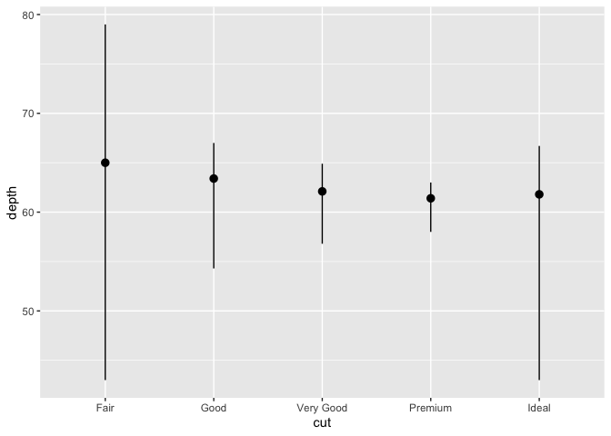

R4ds\_solutions
================
Kyle Howard
2021-03-29

## R for Data Science Solutions

I only began documenting my workings for the [R for Data science
textbook exercises](https://r4ds.had.co.nz) from Exercise 6 onwards.
This document serves as a way to remember the solutions and how I
arrived at them, and to help learn R markdown and github processes.

## 3.6 Geometric Objects

### Exercise 6: Recreate the R code necessary to generate the following graphs

``` r
library(ggplot2)

ggplot(data = mpg, mapping = aes(x = displ, y = hwy)) + 
  geom_point() + 
  geom_smooth(se=FALSE)
```

    ## `geom_smooth()` using method = 'loess' and formula 'y ~ x'

<!-- -->

``` r
ggplot(data = mpg, mapping = aes(x = displ, y = hwy)) + 
  geom_point() + 
  geom_smooth(aes(group=drv), se=FALSE)
```

    ## `geom_smooth()` using method = 'loess' and formula 'y ~ x'

<!-- -->

``` r
ggplot(data = mpg, mapping = aes(x = displ, y = hwy, colour = drv)) + 
  geom_point() + 
  geom_smooth(aes(fill=drv), se=FALSE)
```

    ## `geom_smooth()` using method = 'loess' and formula 'y ~ x'

<!-- -->

``` r
ggplot(data = mpg, mapping = aes(x = displ, y = hwy)) + 
  geom_point(mapping = aes(colour = drv)) + 
  geom_smooth(se=FALSE)
```

    ## `geom_smooth()` using method = 'loess' and formula 'y ~ x'

<!-- -->

``` r
ggplot(data = mpg, mapping = aes(x = displ, y = hwy)) + 
  geom_point(mapping = aes(colour = drv)) + 
  geom_smooth(mapping = aes(linetype=drv),se=FALSE)
```

    ## `geom_smooth()` using method = 'loess' and formula 'y ~ x'

<!-- -->

``` r
ggplot(data = mpg, mapping = aes(x = displ, y = hwy)) + 
  geom_point(size=4, color = 'white') +
  geom_point(mapping = aes(colour = drv))
```

<!-- -->

## 3.7.1 Statistical transformation exercises:

### 1 the default geom with stat\_summary is geom\_pointrange (?stat\_summary)

``` r
ggplot(data = diamonds) + 
  stat_summary(
    mapping = aes(x = cut, y = depth),
    fun.min = min,
    fun.max = max,
    fun = median
  )
```

<!-- -->

``` r
#can also be written as:
ggplot(data = diamonds) +
  geom_pointrange(
    mapping = aes(x = cut, y = depth),
    stat = "summary",
    fun.min = min,
    fun.max = max,
    fun = median
  )
```

<!-- -->

### 2 What does geom\_col() do? how is it different to geom\_bar()?

??geom\_bar tells you that it has the default stat\_count()

??geom\_col tells you that it has the default stat\_identity() which
leaves the data as is, it doesn’t count the frequency, and expects y
values to be set

### Exercise 3 is a silly question. There is a table in the exercise solutions

### 4\. What variables does stat\_smooth() compute? What parameters control its behaviour?

?stat\_smooth
